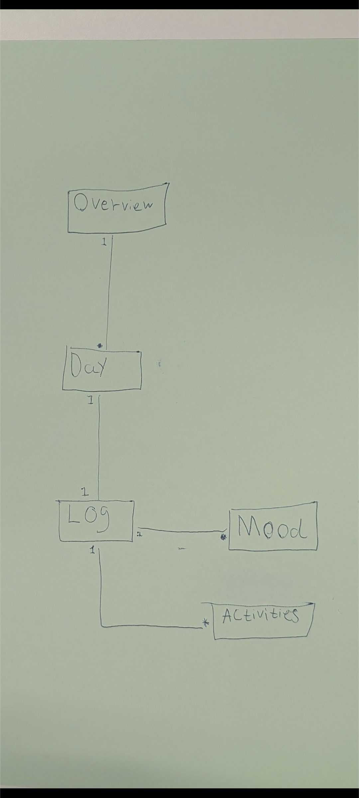
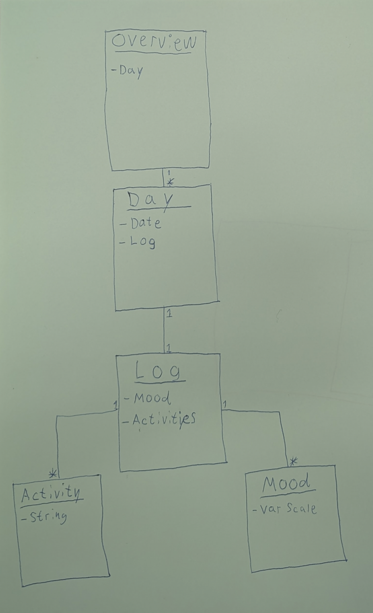

# OptiMind Team
Malde - [Github](https://github.com/MaldeFrank) 
cph-mm737@cphbusiness.dk 
Mikkel - [Github](https://github.com/cph-mh1088) 
cph-mh1088@cphbusiness.dk 
Julius - [Github](https://github.com/JuliusLansner) 
cph-jl483@cphbusiness.dk 

# Project OptiMind
[Github Projects](https://github.com/users/JuliusLansner/projects/12/views/1) 

OptiMind er en app til iphone/android, hvor man kan holde styr på ens humør, mentale tilstand og evt. sygdomme. Man ville kunne dokumentere hvordan man har det, med målet om at få et overblik over sin uge og hvordan man har haft det.

Dette project har til hensigt at være en app til enhver person, som kunne have brug for at forbedre sin hverdag. 

Appen skal kunne have brugere som kan oprette en aktivitet som kan beskrives samt en humørmåler. Brugeren skal dertil kunne have et overblik over sin uge / sin måned med de givne aktiviteter og humørmålinger. 

Formålet er, at se en sammenhæng mellem day-to-day aktiviteter (alt fra job til hobbier) og ens humør for at forbedre ens liv. 

# UseCases

## UC1: Moodlogging
## Scope:
    - Essential Moodlog System
## Level
    - User goal
## Primary Actor:
    - User
## Stakeholders and Interests
    - User: Wants fast, easy, low effort moodlogging
## Preconditions
    - User has installed OptiMind
## Success Guarantee
    - Mood is logged in a local database. Mood Overview is updated. Current Day is updated.
## Main success Scenario
    - User opens the app.
    - User Presses a smiley that resembles their mood.
    - User has their Current Day updated.
    - User has their Mood Overview updated.
## Extensions
    *a. At any time, user chooses the wrong smiley.
     - User can always change the mood they logged.
    *b. At any time, the system fails.
     - The app closes.
     - Nothing from the last mood log is saved.
## Special requirements
    - English/danish phone language
## Technology and data variations list
    - Smartphone 
    - Android
## Frequency of occurrence
    - Whenever the user opens the app.
## Miscellaneous

## Title: Add comment to a mood
## Actor:User
## Description:
Wants to add a comment to a certain mood.

## Title: mood overview 
## Actor:User
## Description:
Wants to get an overview of their mood via a calendar.

## Title: Add an activity to existing activities
## Actor:User
## Description:
Wants to add an activity to store in a dropdown for future use.

## Title: Add activity to a day
## Actor:User
## Description:
Wants to add an activity to a specific day 

# Domain model:

# Class diagram:

